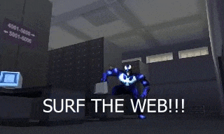

# spidey2000-tools



> **Note:** This project is no longer being maintained. Character/model import is broken, and there are some remaining UV and texture issues on certain maps. Feel free to fork and build on it.

Blender addon and asset extraction tools for **Spider-Man (2000) PC** — the Neversoft / LTI Gray Matter / Activision classic.

Import 3D maps, character models, and textures directly into Blender 4.4+. Extract all audio and video from the game's archives to standard formats.

## Features

### Blender Addon (`io_spiderman2000`)

- **PKR Archive Browser** — Open `data.pkr` directly in Blender's sidebar panel. Browse all 2,448 game files organized by category (levels, characters, objects).
- **Map Import** — Import full game levels with textured geometry, object placement, and correct world-space positioning. One-click import from the N-panel.
- **Model Import** — Import individual `.psx` models (characters, props, vehicles) via `File > Import`.
- **Texture Decoding** — Full support for all game texture formats:
  - VQ compressed (ARGB1555, RGB565, ARGB4444)
  - Twiddled / Morton-order
  - Rectangle / linear
  - 4-bit and 8-bit paletted
- **Material System** — Auto-generated Blender materials with proper shader nodes, UV mapping, and alpha transparency.

### Asset Extraction Scripts

- **`extract_audio.py`** — Extract and convert all 3,636 audio assets:
  - 656 WAV sound effects (direct PCM copy)
  - 58 KAT sound banks with 2,008 embedded samples (4-bit IMA ADPCM decoded to WAV)
  - 972 BIK voice lines and music (extracted + converted to WAV via ffmpeg)
  - 63 SFX lookup tables (exported as metadata)
- **`extract_videos.py`** — Extract and convert all 25 FMV cutscenes from `media.pkr` (BIK to MP4 via ffmpeg)

## Installation

### Blender Addon

1. Copy the `io_spiderman2000/` folder to your Blender addons directory:
   - **Windows**: `%APPDATA%\Blender Foundation\Blender\4.4\scripts\addons\`
   - **Portable**: `<blender>/portable/scripts/addons/`
2. Open Blender > Edit > Preferences > Add-ons
3. Search for "Spider-Man 2000" and enable the addon
4. Access via `File > Import > Spider-Man 2000` or the SM2000 tab in the 3D Viewport sidebar (N-panel)

### Extraction Scripts

Requires Python 3.8+ and optionally ffmpeg for audio/video conversion.

```bash
# Extract all audio
python extract_audio.py --pkr path/to/data.pkr --output audio_export/

# Extract all videos
python extract_videos.py --pkr path/to/media.pkr --output video_export/

# Extract only specific audio types
python extract_audio.py --only wav    # just sound effects
python extract_audio.py --only kat    # just sound banks
python extract_audio.py --only bik    # just voice/music
```

## File Formats

### PKR3 Archive (`data.pkr`, `media.pkr`)

Container format holding all game assets. 8-byte header (magic + directory offset), followed by file data, then a directory with 32-byte filenames and offset/size/compression metadata. Files may be zlib-compressed.

### PSX Model/Scene (`.psx`)

Neversoft's proprietary 3D format shared with the Tony Hawk's Pro Skater series. Contains:

- **Header**: version (u16) + validation (u16) + tag section offset (u32)
- **Object table**: world positions and model references
- **Mesh data**: vertices (int16 per component), faces with flags for triangle/quad, textured, gouraud shading, invisibility
- **UV coordinates**: v3/v4 use u8 pairs (÷256), v6 uses u16 values (÷512)
- **Tag section**: metadata, vertex colors, texture name CRC hashes
- **Palettes**: 4-bit (16 colors) and 8-bit (256 colors) in RGB555 format
- **Textures**: pixel data in VQ, twiddled, or rectangle formats with PVR-style headers

### KAT Sound Banks (`.kat`)

Per-level sound banks containing multiple audio assets. 4-byte asset count header, followed by an array of 44-byte `SSfxAsset` descriptors (offset, size, sample rate, bit depth), then raw 4-bit IMA ADPCM audio data. All assets are mono.

### SFX Lookup Tables (`.sfx`)

Binary mapping tables that associate game sound IDs with KAT bank buffer indices and playback parameters (volume, pitch, flags). 4-byte header + 16-byte records terminated by `0xFFFFFFFF`.

### BIK Video (`.bik`)

RAD Game Tools Bink Video format. Used for FMV cutscenes (320x192, `media.pkr`) and audio-only voice/music streams (`data.pkr`). The game plays music BIKs with video disabled via `BinkSetVideoOnOff(handle, 0)`.

## Project Structure

```
spidey2000-tools/
├── io_spiderman2000/              # Blender addon
│   ├── __init__.py                # Addon registration
│   ├── operators.py               # Import operators (PKR browser, PSX file)
│   ├── ui_panels.py               # N-panel sidebar asset browser
│   ├── preferences.py             # Addon preferences
│   ├── pkr_parser.py              # PKR3 archive reader (lazy, seek-on-demand)
│   ├── psx_parser.py              # PSX model/scene binary parser
│   ├── texture_decoder.py         # 4/8/16-bit texture decoding (VQ, twiddled, rect)
│   ├── mesh_builder.py            # Parsed data → Blender meshes (BMesh API)
│   ├── material_builder.py        # Materials + shader nodes from textures
│   ├── audio_decoder.py           # KAT/SFX parser + IMA ADPCM decoder
│   ├── animation_builder.py       # Armature/skeleton (WIP)
│   ├── constants.py               # Format constants, flags, level names
│   └── utils.py                   # BinaryReader, coordinate conversion
├── extract_audio.py               # Bulk audio extraction script
├── extract_videos.py              # FMV cutscene extraction script
└── README.md
```

## References

This project builds on work from the Spider-Man 2000 reverse engineering community:

- **[spidey-decomp](https://github.com/krystalgamer/spidey-decomp)** — Full game decompilation by krystalgamer. Authoritative source for format details, audio system (`DXsound`, `ps2lowsfx`), and game logic.
- **[spidey-tools](https://github.com/krystalgamer/spidey-tools)** — PKR extractor and format documentation.
- **[thps2-tools](https://github.com/JayFoxRox/thps2-tools)** — PSX model format parser by JayFoxRox. The PSX format is shared across Neversoft's "Big Guns" engine (THPS, Spider-Man).
- **[io_thps_scene](https://github.com/denetii/io_thps_scene)** — Blender addon for THPS scene import by denetii. Reference for mesh building and material creation patterns.

## License

MIT
